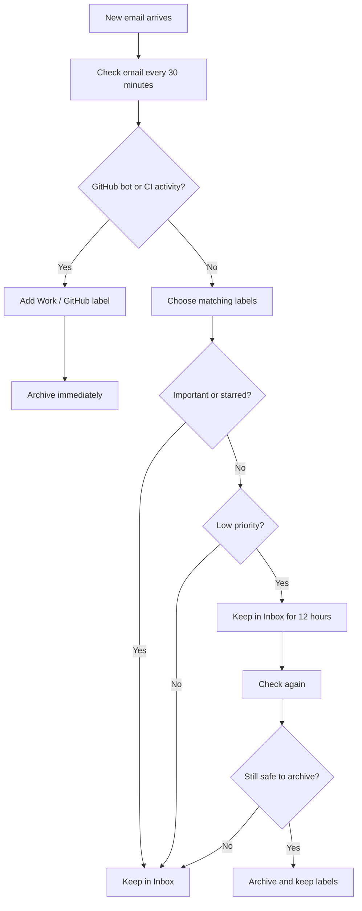

# Gmail Inbox Organizer

This project organizes incoming Gmail messages automatically. It adds useful
labels, keeps important messages in the Inbox, and archives selected
low-priority messages.

Archived messages are not deleted. They remain available under their Gmail
labels and through Gmail search. Unread messages stay unread.

## How it works



## What stays in the Inbox

- Emails that need action
- Meeting notes
- Website form submissions from Web3Forms
- Income and payment records
- Banking emails
- Security alerts
- Job applications
- Starred emails
- Emails the organizer does not recognize
- Important GitHub activity, including failed checks, invitations, review
  requests, assignments, direct mentions, blocking comments, and requested
  changes

## What can be archived after 12 hours

- Routine GitHub updates
- Job alerts
- Learning emails
- Reading lists and product notices
- Social emails
- Subscription updates that are not payment records

## Supported banks and products

Web3Forms submissions receive `02 Work/Web3Forms` and stay in the Inbox.
The rule matches `notify@web3forms.com` and `notify+...@web3forms.com`,
regardless of the submission subject. Welcome/support emails and Google
account notices do not receive this label. Existing labels and unread status
are preserved. Upload the updated script with `npm run push` to enable the
rule in the existing automation; no trigger reinstall is needed.

Trusted bank mail currently covers MariBank and MariCard debit activity,
UnionBank account and Visa debit activity, and BPI account activity. Transaction
records stay in the Inbox. Security events receive both Banking and Security;
failed, declined, reversed, or unauthorized transactions receive both Action
and Transactions. Account and card setup mail receives Banking. Bank advisories
receive Notices, while bank promotions receive Social and can archive after 12
hours unless starred.

Wise income behavior is unchanged: recognized Wise income receives both Income
and Transactions. Other bank deposits and incoming transfers receive
Transactions only.

Recognized Atome Card transaction confirmations from `atome.ph` senders,
including `service.atome.ph`, receive `03 Money/Transactions` and stay in the
Inbox. Failed, declined, reversed, cancelled, unsuccessful, or unauthorized
transactions also receive `01 Action`. Verification codes, payment reminders,
and promotional Atome mail do not receive Transactions solely because they
mention Atome or payments. Atome account mail does not automatically receive
Banking.

GitHub bot and CI activity messages are different: they receive the
`02 Work/GitHub` label and are archived during the next check without waiting
12 hours.

## Safety rules

- Never deletes emails
- Never moves emails to Trash
- Never marks emails as read
- Never removes useful destination labels
- Removes only the Inbox location when archiving
- Checks an email again before archiving it
- A starred email always stays in the Inbox, except GitHub bot and CI activity
  messages

## First-time setup

Install project packages:

```bash
npm install
```

Check the project:

```bash
npm test
npx clasp status
```

Upload changes to Google Apps Script:

```bash
npx clasp push
```

Open Google Apps Script:

```bash
npm run open
```

In Google Apps Script, choose `installAutomation`, then click **Run**. This
creates one automatic check that runs every thirty minutes.

You do not need the **Deploy** button for this project.

## Turn on selected archiving

Archiving is off until you turn it on.

Run these functions from Google Apps Script in this order:

1. `previewArchiveBackfill30Days` shows what would be archived.
2. `enableArchiveAutomation` turns on archiving for future emails.
3. `queueArchiveBackfill30Days` optionally includes approved emails from the
   previous 30 days.

Running a preview does not change Gmail.

## Turn off selected archiving

Run `disableArchiveAutomation`.

Labeling continues, but no regular emails are queued for archive. Emails still
waiting in the 12-hour queue are removed from that queue. GitHub bot and CI
activity mail continues to archive immediately.

## Stop all automation

Run `removeAutomation`.

This removes the thirty-minute check, turns off selected archiving, and clears
the waiting queue. Existing Gmail labels and emails remain unchanged.

## Label older emails without archiving

Run these functions in order:

1. `previewBackfill30Days` shows label choices for the previous 30 days.
2. `backfillLast30Days` adds those labels without archiving messages.

To label only existing Atome transaction messages in the Inbox, run
`previewAtomeBackfill30Days` first. Check its candidate list, then run
`backfillAtomeTransactions30Days`. This adds Transactions and, for failed
transactions, Action. It does not archive messages or label unrelated mail.

## Updating the project

After changing `Code.js`, files inside `helpers/`, or `appsscript.json`, run:

```bash
npm test
npx clasp push
```

You normally do not need to run `installAutomation` again. The existing
thirty-minute check uses the newest uploaded code.

For every available clasp command, see [docs/COMMAND.md](docs/COMMAND.md).
